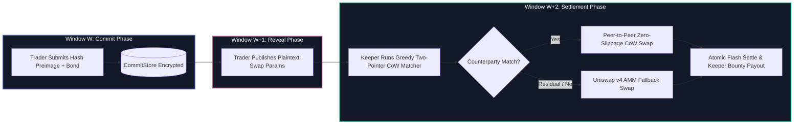
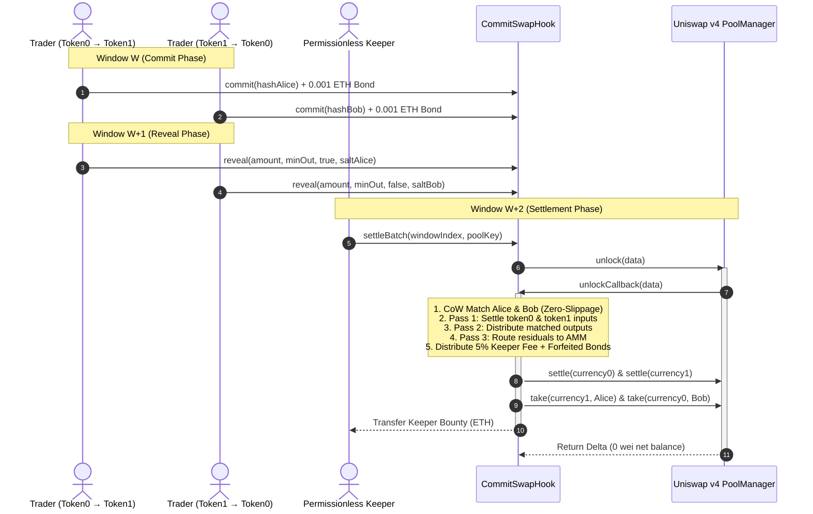
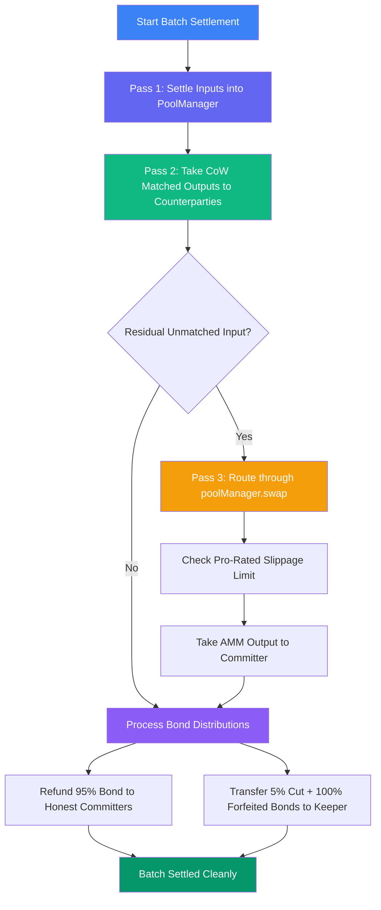

# CommitSwap ⚡

> **Zero-MEV Commit-Reveal Batch Swap Protocol powered by Uniswap v4 Hooks & Coincidence of Wants (CoW) Matching.**

[](https://github.com/Shubhojit-17/CommitSwap/actions/workflows/test.yml)
[](https://soliditylang.org/)
[](https://github.com/uniswap/v4-core)
[](https://getfoundry.sh/)
[](LICENSE)
[](https://github.com/Shubhojit-17/CommitSwap)

---

## 📌 Executive Summary

Decentralized exchanges on public mempools suffer from severe **Maximal Extractable Value (MEV)** extraction—including front-running, sandwich attacks, and Loss-Versus-Rebalancing (LVR)—costing retail traders billions annually.

**CommitSwap** is a native Uniswap v4 Hook that eliminates transaction-level MEV by transforming continuous AMM order processing into a **3-stage pipelined commit-reveal batch auction** with peer-to-peer **Coincidence of Wants (CoW)** matching and automatic AMM fallback routing.



---

## 🔑 Key Features & Architecture

### 1. Cryptographic MEV Elimination
* **Opaque Commit Phase**: Traders submit only `keccak256(abi.encode(amount, minAmountOut, zeroForOne, poolId, salt, committer))` accompanied by a refundable ETH bond. Searchers and block builders cannot extract information regarding token directions or trade sizes.
* **Deterministic Window Arithmetic**: Time is quantized into constant-block windows (`windowIndex = block.number / WINDOW_BLOCKS`), preventing block timestamp manipulation.

### 2. Pipelined 3-Stage Pipeline
The protocol pipelines window execution so that batch swaps settle continuously without pausing or blocking trading activity:

| Pipeline Stage | Active Window | Action Taken |
|---|---|---|
| **Stage 1: Commit** | `Window W` | Traders commit cryptographic preimages + deposit bond. |
| **Stage 2: Reveal** | `Window W - 1` | Plaintext parameters published; hashes validated; bonds retained. |
| **Stage 3: Settle** | `Window W - 2` | Keepers execute CoW matching + AMM fallback in a single atomic flash session. |



---

### 3. Flash Accounting & Two-Pass Settlement

CommitSwap executes entirely inside Uniswap v4's `PoolManager.unlock()` / `unlockCallback()` flash accounting session:



1. **Pass 1 (Input Settle)**: All CoW-matched input tokens are pulled from committers and deposited into the `PoolManager` via `_settleCurrency()`.
2. **Pass 2 (CoW Output Take)**: Matched output amounts are transferred directly from `PoolManager` to counterparties without incurring AMM swap fees or price impact.
3. **Pass 3 (AMM Fallback)**: Residual unmatched amounts are executed via `poolManager.swap()`, verifying pro-rated slippage against `minAmountOut`.
4. **Pass 4 (Bond Retention & Keeper Bounty)**: Revealed commitments refund 95% of their bond to users, while 5% fee + 100% of unrevealed forfeited bonds are transferred to the settling keeper.

---

### 4. Greedy Two-Pointer CoW Matching Algorithm

The [`IntentMatcher`](src/IntentMatcher.sol) contract implements pure, gas-optimized two-pointer CoW matching:

* **Sorting**: Sorts revealed buy orders and sell orders descending by amount.
* **Spot Price Conversion**: Converts Uniswap v4 `sqrtPriceX96` to fixed-point $10^{18}$ price representation:
  $$\text{price18} = \frac{(\text{sqrtPriceX96})^2 \times 10^{18}}{2^{192}}$$
* **512-Bit Safe Arithmetic**: Uses inline assembly `mulmod` / `_mulDiv` preventing intermediate numeric overflow.
* **Conservation Invariant**: For every commitment, $\text{matchedAmountIn} + \text{residualAmountIn} = \text{amount}$.

---

## 🛡️ Threat Model & Attack Defenses

| Threat Vector | Attack Scenario | CommitSwap Defense Mechanism | Result |
|---|---|---|---|
| **Front-running / Sandwiching** | Searcher observes pending mempool swaps and front-runs order. | Cryptographic commitment hides token, direction, and amount. | **0 MEV Extracted** (100% immune) |
| **Free-Option Griefing (G1)** | User commits opposite trade, waits for market movement, and withholds reveal if price drops. | Unrevealed commitments forfeit **100% of their bond** to the keeper; counterparty routes safely to AMM fallback. | **Strict negative expected value for attacker** |
| **Dust Spam Denial-of-Service** | Attacker spams thousands of micro-commitments to congest batch. | Every commitment requires a mandatory `MIN_BOND` deposit. Unrevealed spam bonds are claimed by keepers. | **Cost-prohibitive for attacker** |
| **Slippage Exploitation** | AMM fallback leg experiences sudden liquidity shift. | Enforces strictly pro-rated `minAmountOut` on AMM swaps; reverts batch if slippage breached. | **Guaranteed price execution bounds** |

---

## 🖥️ Interactive Web Dashboard

CommitSwap includes a complete frontend web application located in [`frontend/`](frontend/):

* **Live Window Visualizer**: Real-time ticker tracking active block, commit window $W$, reveal window $W-1$, and settlement window $W-2$.
* **Trader Terminal**: Intent creation form with automatic WebCrypto salt generation, hash calculation, and one-click commitment with ETH bond.
* **Reveal Desk**: Automatically tracks stored commitments and publishes plaintext preimages during eligible reveal windows.
* **Keeper Settlement Engine**: Live visualization of CoW paired counterparty volume, AMM fallback estimates, and one-click batch settlement.
* **Dual Mode**: Seamlessly toggle between **Live Web3** (MetaMask, Base Sepolia) and **Interactive Simulator Mode**.


---

## 📂 Repository Structure

```
CommitSwap/
├── src/
│   ├── BaseHook.sol             # Abstract Uniswap v4 base hook with permission checks
│   ├── CommitRevealStore.sol    # Commit-reveal state machine with bond retention
│   ├── CommitSwapHook.sol       # Full Hook with settleBatch & CoW flash accounting
│   └── IntentMatcher.sol        # Pure 512-bit safe math greedy two-pointer matcher
├── test/
│   ├── CommitRevealStore.t.sol  # 46 unit & fuzz tests for storage & window boundaries
│   ├── CommitSwapHook.t.sol     # 12 integration tests for hook callbacks & settlement
│   ├── IntentMatcher.t.sol      # 9 unit & invariant fuzz tests for matching math
│   └── MEVSimulation.t.sol      # 3 end-to-end attack simulation tests
├── script/
│   └── Deploy.s.sol             # CREATE2 salt miner (salt: 562) & deployment script
├── frontend/
│   ├── index.html               # Semantic glassmorphic Web3 dashboard
│   ├── style.css                # Dark mode design system with Outfit / JetBrains typography
│   └── app.js                   # Client engine with in-browser CoW matching simulator
├── docs/                        # Complete 9-part architectural specification & review docs
├── .github/workflows/test.yml   # Automated GitHub Actions CI workflow
└── foundry.toml                 # Foundry configuration & Uniswap v4 remappings
```

---

## 🛠️ Getting Started & Testing

### Prerequisites
* [Foundry](https://getfoundry.sh/) (Forge, Cast, Anvil)
* [Node.js](https://nodejs.org/) (for serving frontend)

### Installation & Build

```bash
# Clone the repository
git clone https://github.com/Shubhojit-17/CommitSwap.git
cd CommitSwap

# Install submodules (Uniswap v4 core & periphery)
forge install

# Build smart contracts
forge build
```

### Running Test Suite (70 Tests)

```bash
# Run all unit, fuzz, and integration tests
forge test --summary

# Run specific test suites with verbose traces
forge test --match-contract CommitSwapHookTest -vvv
forge test --match-contract MEVSimulationTest -vvv
forge test --match-contract IntentMatcherTest -vvv
```

### Launching Frontend Locally

```bash
cd frontend
# Serve frontend using any static file server (e.g. Python, Node npx serve)
npx -y serve .
# Open http://localhost:3000 in your browser
```

---

## 📜 License

This project is licensed under the **MIT License** — see the [LICENSE](LICENSE) file for details.
